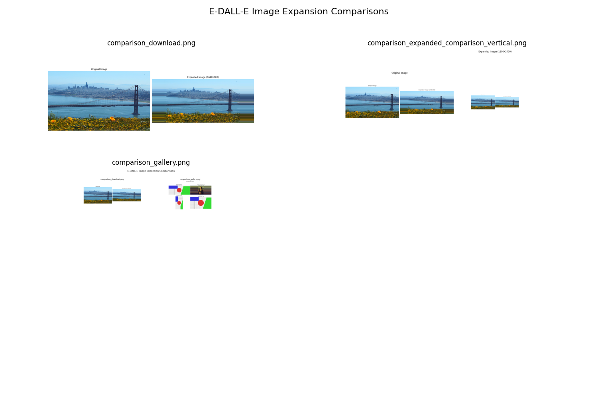
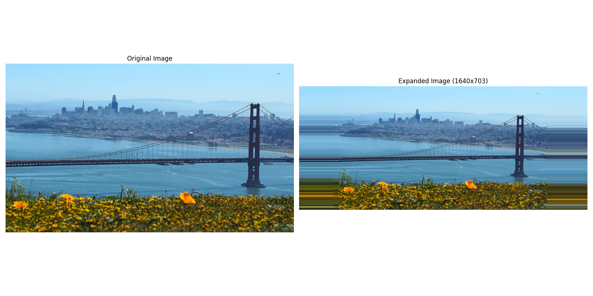
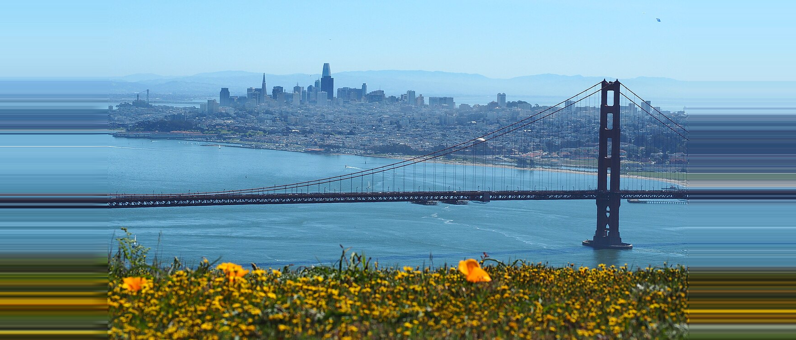
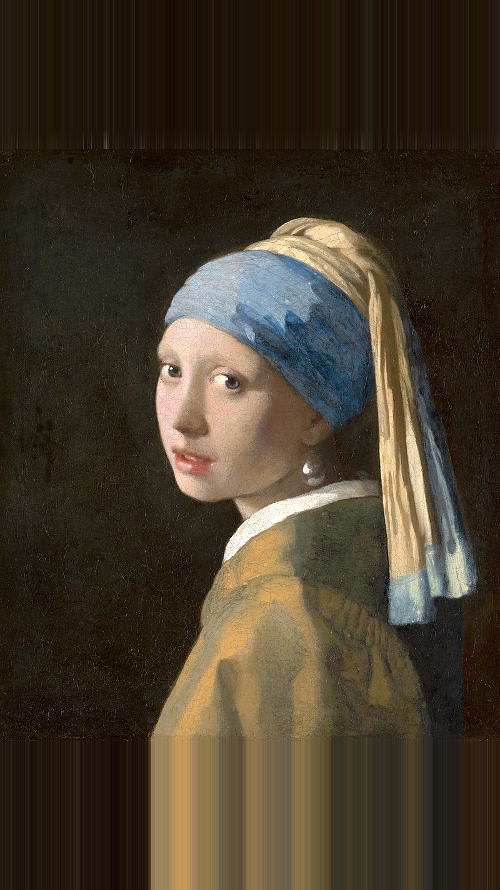
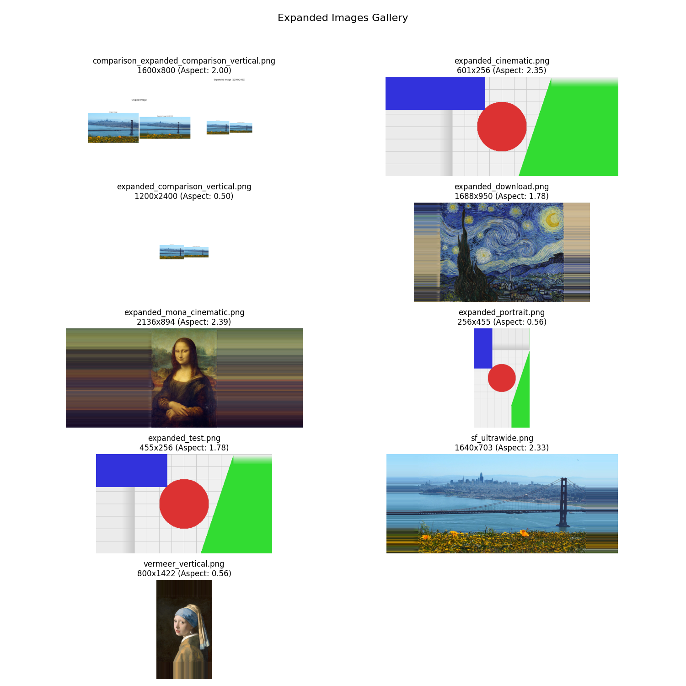

# E-DALL-E: Image Generation and Expansion System



This project combines DALL-E Mini for text-to-image generation with a novel expansion technique (E-DALL-E) that allows creating images with different aspect ratios. It also provides standalone tools for expanding existing images to various aspect ratios without requiring AI generation.

## 🌟 Overview

The system consists of these integrated components:

1. **DALL-E Mini** - Generates square (1:1) images from text prompts
2. **E-DALL-E** - Expands the generated images to different aspect ratios (e.g., 16:9) using VQGAN+CLIP
3. **Image Expander (Online)** - A tool to download and expand online images to different aspect ratios
4. **Image Expander (Local)** - A tool to expand local image files to different aspect ratios
5. **Results Viewer** - A gallery tool to view all expanded images created with the system

## 📦 Installation

Install the required dependencies:

```bash
pip install -r requirements.txt
```

## 🚀 Main Features

### AI Image Generation and Expansion

Run the main script with a text prompt to generate and expand images:

```bash
python edalle.py --prompt "a painting of rolling farmland" --aspect_ratio 1.78 --num_images 4
```

#### Command Line Arguments

- `--prompt`: Text prompt for image generation (default: "a painting of rolling farmland")
- `--num_images`: Number of images to generate (default: 4)
- `--aspect_ratio`: Target aspect ratio for expansion (width/height, default: 16/9)
- `--iterations`: Number of optimization iterations for expansion (default: 100)
- `--model_type`: DALL-E model size ("mini", "mega", or "mega-full", default: "mega")

### Online Image Expansion

Download and expand any online image to your desired aspect ratio:

```bash
python download_expand.py --url "https://example.com/image.jpg" --aspect 16:9 --orientation landscape
```

#### Example Results



#### Command Line Arguments

- `--url`: URL of the image to download (defaults to a sample Van Gogh image)
- `--aspect`: Target aspect ratio, can be in format "16:9" or decimal "1.78" (default: "16:9")
- `--orientation`: Orientation of the expansion, "landscape" or "portrait" (default: "landscape")
- `--output`: Path to save the expanded image (default: "expanded_download.png")

### Local Image Expansion

Expand any local image file to your desired aspect ratio:

```bash
python local_expand.py input_image.jpg --aspect 21:9 --orientation landscape
```

#### Example Results




#### Command Line Arguments

- First argument: Path to the input image file (required)
- `--aspect`: Target aspect ratio, can be in format "16:9" or decimal "1.78" (default: "16:9")
- `--orientation`: Orientation of the expansion, "landscape" or "portrait" (default: "landscape")
- `--output`: Path to save the expanded image (default: "expanded_" + input filename)

### Results Gallery Viewer

Create visual galleries of all expanded images:

```bash
python view_results.py
```



This script will:
1. Scan the current directory for expanded and comparison images
2. Generate two gallery images:
   - `comparison_gallery.png`: Shows side-by-side comparisons of original and expanded images
   - `expanded_gallery.png`: Shows all expanded images with their dimensions and aspect ratios

## 🧠 How It Works

### DALL-E + Expansion Process

1. The system first generates square (1:1) images using DALL-E Mini based on your text prompt
2. It then expands one of these images to your desired aspect ratio in two steps:
   - Initially filling in the sides with repeated edge pixels
   - Using VQGAN+CLIP to generate new content on the sides that matches the style and content of the original image and follows the text prompt

### Edge Pixel Expansion Technique

The edge pixel expansion process:

1. Creates a canvas with the target dimensions
2. Places the original image in the center
3. Fills the empty regions by repeating and blending edge pixels from the original image
4. Applies a gradient blend to ensure smooth transitions

## 📋 Supported Aspect Ratios

The system supports any aspect ratio, but here are some common ones:

| Aspect Ratio | Common Use Cases |
|--------------|------------------|
| 1:1 (1.0)    | Standard square images, Instagram |
| 4:3 (1.33)   | Traditional TV/monitors |
| 16:9 (1.78)  | HD video, modern displays |
| 21:9 (2.33)  | Ultrawide monitors, cinematic |
| 2.39:1       | Anamorphic widescreen cinema |
| 9:16 (0.56)  | Vertical video, mobile devices |

## 🖼️ Output Files

The system generates various output files:

- Original images: `original_*.png`
- Expanded images: `expanded_*.png`
- Comparison images: `comparison_*.png`
- Gallery images: `expanded_gallery.png` and `comparison_gallery.png`

## 🔧 Advanced Usage

### Creating Custom Aspect Ratios

You can specify custom aspect ratios in two formats:
- Ratio format: `--aspect 4:3`
- Decimal format: `--aspect 1.33`

### Combining Tools

You can chain these tools together for creative workflows:
1. Generate images with `edalle.py`
2. Expand existing images with `local_expand.py`
3. View all results with `view_results.py`

## 👏 Acknowledgments

This implementation is based on:
- [DALL-E Mini](https://github.com/borisdayma/dalle-mini) by Boris Dayma and Pedro Cuenca
- [VQGAN+CLIP](https://github.com/patil-suraj/vqgan-jax) for image expansion
- The original E-DALL-E concept by Robert A. Gonsalves

## 📃 License

This project is available under the MIT License. See the LICENSE file for more information.
